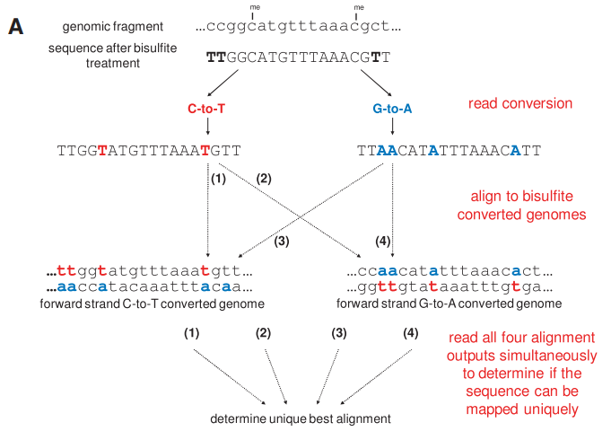

<!-- TOC -->

- [bismark是什么？](#bismark是什么)
- [工作原理](#工作原理)
- [使用方法](#使用方法)
- [步骤+结果解读](#步骤结果解读)
  - [1. Bismark基因组的准备](#1-bismark基因组的准备)
  - [2. QC+trim+Alignment](#2-qctrimalignment)
  - [3. Deduplication](#3-deduplication)
  - [4. methylation extractor](#4-methylation-extractor)
  - [5. Bismark HTML 处理报告](#5-bismark-html-处理报告)
- [参考文章：](#参考文章)

<!-- /TOC -->
## bismark是什么？
Bismark是一套用于高效分析Bisulfite-Seq（BS-Seq）数据的工具。Bismark同时对齐参考基因组和细胞嘧啶甲基化调用进行亚硫酸氢盐处理的读数。Bismark用Perl编写，并从命令行运行。亚硫酸盐处理的读数使用短读对齐器Bowtie 2或HISAT2进行映射。
## 工作原理

* Bisulfite重亚硫酸盐将序列<mark>正链的C转换为T，负链将G转换为A</mark>，经过PCR形成四种情况的序列。
* 每个reads与进行相同转换的参考基因组通过Bowtie进行比对，并推断读取中所有细胞嘧啶位置的甲基化状态。 
* 如果对齐具有唯一的最佳对齐分数（如AS:i字段报告），则读取被视为唯一对齐。如果读取产生多个不匹配次数相同或对齐分数相同的对齐（AS:i字段），则读取（或读取对）将被完全丢弃。
## 使用方法
[见github官网](https://github.com/FelixKrueger/Bismark/tree/master/Docs)

## 步骤+结果解读

### 1. Bismark基因组的准备

可以从ensemble数据库下载对应的参考基因组序列文件。需要指定一个目录，其中包含想要对齐读取的基因组（请注意，bismark_genome_preparation脚本需要FastA此文件夹中的文件（带有.fa或.fasta扩展名，每个文件的单个或多个序列条目）。Bismark 将在其中创建两个单独的文件夹这个目录，一个用于 C->T 转换的基因组，另一个用于 G->A 转换的基因组。创建 C->T 和 G->A 版本的基因组后，它们将使用索引器并行索引bowtie2-build（或hisat2-build)。

`bash
bismark_genome_preparation --path_to_aligner /usr/bin/bowtie2/ --verbose /data/genomes/homo_sapiens/GRCh38/`

### 2. QC+trim+Alignment

 等同于二代测序数据处理的步骤的解读。
  <center><br><br><mark>以下才是重点关注的结果内容。</mark><br><br></center>

### 3. Deduplication 

<br>对于单端比对，只有染色体、起始坐标和读取链将用于重复数据删除。
<br>对于双端比对，染色体、读取对的链、第一个读取的起始坐标以及第二个读取的起始坐标将用于重复数据删除。此脚本要求 Bismark 输出为 SAM/BAM 格式。

* 使用 UMI 或barcode进行重复数据删除：
<br>除了染色体、起始（和双端文库的结束位置）位置和链方向之外，该选项--barcode还将在去重时考虑潜在的条形码或 UMI（唯一分子标识符）。

* 对同一库的多个文件进行重复数据删除


### 4. methylation extractor
 <br>Bismark 附带一个补充bismark_methylation_extractor脚本，该脚本对 Bismark 结果文件进行操作并提取分析的每个 C 的甲基化调用。每个单个 C 的位置将被写出到一个新的输出文件，这取决于它的上下文（CpG、CHG 或 CHH），其中甲基化的 Cs 将被标记为正向读取 (+)，非甲基化的 Cs 将被标记为反向读取 (- ）。

* Strand-specific methylation output files (default)链特异性甲基化输出文件 *.deduplicated.txt（默认）:

<mark>输出结果：</mark>

```python
    1. seq-ID (序列ID)
    2. methylation state (甲基化状态， “+”是甲基化的，“-”是非甲基化的)
    3. chromosome (染色体)
    4. start position (= end position) (起始/结束位置 )
    5. methylation call (甲基化call)
    z- C in CpG context - unmethylated
    Z - C in CpG context - methylated
    X- C in CHG context - unmethylated
    X- C in CHG context - methylated
    h- C in CHH context - unmethylated
    H- C in CHH context - methylated
    u- C in Unknown context (CN or CHN) - unmethylated
    ∪- C in Unknown context (CN or CHN) - methylated
```
<font color=red>甲基化胞嘧啶有一个+方向，未甲基化的胞嘧啶有一个-方向。</font>

CpG 上下文中胞嘧啶的示例：
```
HWUSI-EAS611_0006:3:1:1058:15806#0/1 - 6 91793279 z
HWUSI-EAS611_0006:3:1:1058:17564#0/1 + 8 122855484 Z
```
CHG 上下文中的胞嘧啶示例：
```
HWUSI-EAS611_0006:3:1:1054:1405#0/1 - 7 89920171 x
HWUSI-EAS611_0006:3:1:1054:1405#0/1 + 7 89920172 X
```
CHH 中胞嘧啶的示例：
```
HWUSI-EAS611_0006:3:1:1054:1405#0/1 - 7 89920184 h
```
Bismark 附带一个补充`bismark_methylation_extractor`脚本，该脚本对 Bismark 结果文件进行操作并提取分析的每个 C 的甲基化调用。每个单个 C 的位置将被写出到一个新的输出文件，这取决于它的上下文（CpG、CHG 或 CHH），其中甲基化的 Cs 将被标记为正向读取 (+)，非甲基化的 Cs 将被标记为反向读取 (- ）。生成的文件可以导入到基因组查看器中，例如 SeqMonk（使用通用文本导入过滤器），然后可以开始分析甲基化数据。可选地，甲基化提取器的输出可被转换为`bedGraph`和`coverage`使用选项文件`--bedGraph`（也见`--counts`）。

生成的文件中：
```
    OT    –  original top strand
    CTOT  –  complementary to original top strand
    OB    –  original bottom strand
    CTOB  –  complementary to original bottom strand
```
* 上下文相关的甲基化输出文件（--comprehensive选项）：
    
如果对特定链的甲基化不感兴趣，则所有可用的甲基化信息都可以汇集到一个与上下文相关的文件中（将汇集来自四条链中任何一条的信息）。这将默认为三个输出文件（CpG-context、CHG-context 和 CHH-context），或者如果--merge_non_CpG选择了会产生2 个输出文件（CpG-context 和 Non-CpG-context）（注意这会导致巨大的文件非 CpG 输出的大小）。

* Optional bedGraph output 可选的<mark>bedGraph输出</mark>

Bismark 甲基化提取器还可以选择bedGraph以使用基于 0 的基因组起始坐标和基于 1 的结束坐标的格式输出文件。该模块bismark2bedGraph（Bismark 包的一部分）也可以单独运行。它将按染色体坐标排序，如下所示：
```
  <chromosome> <start position> <end position> <methylation percentage>
```    

由于甲基化百分比本身并不提供在某个位置检测到的甲基化或未甲基化读数的实际读数覆盖率的信息，因此bismark2bedGraph还会写出一个覆盖率文件（使用基于 1 的基因组基因组坐标），其中包含两个额外的列：
```
<chromosome> <start position> <end position> <methylation percentage> <count methylated> <count unmethylated>
```

* (可选）：全基因组胞嘧啶报告输出

从coverage输出开始，Bismark 甲基化提取器还可以选择输出全基因组胞嘧啶甲基化报告。该模块coverage2cytosine（Bismark 包的一部分）也可以单独运行。它也按染色体坐标排序，但也包含序列上下文，格式如下：
```r
 <chromosome> <position> <strand> <count methylated> <count unmethylated> <C-context> <trinucleotide context>
 <染色体> <位置> <链> <甲基化的count> <非甲基化的count> <C-context> <三核苷酸背景>
```
<mark>与bedGraphorcoverage输出的主要区别在于顶部和底部链上的每个胞嘧啶都将被考虑，而不管它们是否被实验中的任何读数实际覆盖。</mark>

* <font color = red>M偏差图(M-bias)</font>

从 Bismark v0.8.0 开始，Bismark 甲基化提取器还生成一个甲基化偏差图，显示读取中每个可能位置的甲基化比例（更详细的描述见：Hansen et al., Genome Biology, 2012, 13:R83） . M-bias 图的数据也写入覆盖文本文件（以.cov或结尾.cov.gz），对于双端读取，将绘制两个单独的 M-bias 图。格式如下：
 ```
<read position> <count methylated> <count unmethylated> <% methylation> <total coverage>
```
<mark>M-bias 图应该使研究人员能够做出明智的决定，是在最终数据中保留偏差还是删除它（例如使用甲基化提取器选项--ignore）。</mark>

### 5. Bismark HTML 处理报告

<br>该脚本`bismark2report`使用 Bismark 对齐报告，以及可选的 Bismark 套件的进一步报告，例如重复数据删除、甲基化提取器（拆分）或 M-bias 报告，以生成图形化的 HTML 报告页面。如果在同一文件夹中找到多个 Bismark 报告，将为每个报告生成一个单独的报告，其中输出文件名来自 Bismark 对齐报告文件。`bismark2report`尝试根据文件基本名称自动查找可选报告。以下是单端报告和双端报告的示例。

> 选项
* -o/--output <filename>
<br>输出文件的名称（可选）。如果未明确指定，输出文件名将从 Bismark 对齐报告文件派生。指定输出文件名仅适用于为单个 Bismark 对齐报告（以及可能的附加报告）生成 HTML 报告。

* --dir <directory>
<br>输出目录。如果未明确指定，则输出将写入当前目录。

* --alignment_report FILE
<br>如果未明确指定，则bismark2report尝试在当前目录中查找 Bismark 报告文件并为每个映射报告文件生成单独的 HTML 报告。根据 Bismark 映射报告的基本名称，bismark2report还将尝试查找其他 Bismark 报告（见下文）以包含在 HTML 报告中。必须指定 Bismark 对齐报告文件。

* --dedup_report FILE
<br>如果未明确指定，则bismark2report尝试deduplicate_bismark在当前工作目录中查找与 Bismark 映射报告（由 生成）具有相同基名的重复数据删除报告文件。包含重复数据删除报告是可选的，使用 FILE 'none'将完全跳过此步骤。

* --splitting_report FILE
<br>如果未明确指定，则bismark2report尝试在当前工作目录中查找与 Bismark 映射报告（由 Bismark 甲基化提取器生成）具有相同基名的拆分报告文件。包括拆分报告是可选的，使用 FILE 'none'将完全跳过此步骤。

* --mbias_report FILE
<br>如果未明确指定，则bismark2report尝试在当前工作目录中查找与 Bismark 映射报告（由 Bismark 甲基化提取器生成）具有相同基名的单个 M-bias 报告文件。包括 M-Bias 报告是可选的，使用 FILE 'none'将完全跳过这一步。

* --nucleotide_report FILE
<br>如果未明确指定，则bismark2report尝试在当前工作目录中查找与 Bismark 映射报告（由 Bismark 使用选项生成--nucleotide_coverage或bam2nuc直接生成）具有相同碱基名称的单核苷酸覆盖报告文件。包括核苷酸覆盖率统计报告是可选的，使用 FILE 'none'将完全跳过此报告。


## 参考文章：
1. [Bismark Bisulfite Mapper学习笔记（二）甲基化信息提取以及文件解读](https://www.jianshu.com/p/e71184d03ace)
2. [Bismark Bisulfite Mapper User Guide -v0.23.0](https://github.com/FelixKrueger/Bismark/tree/master/Docs)


