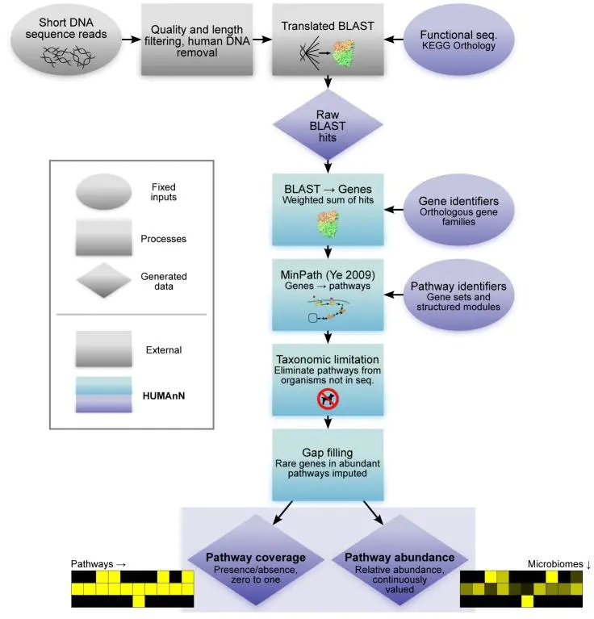

# Metagenomic_StudyAccount

<!-- TOC -->

- [Metagenomic_StudyAccount](#metagenomic_studyaccount)
  - [（1） Background](#1-background)
  - [（2） Taxonomy](#2-taxonomy)
    - [[1] Alpha and beta diversity](#1-alpha-and-beta-diversity)
    - [[2] Strain-level metagenomics](#2-strain-level-metagenomics)
    - [[3] 泛基因组 Pangenome](#3-泛基因组-pangenome)
  - [（3）标记基因分析](#3标记基因分析)
  - [（4）核糖体序列 16S](#4核糖体序列-16s)
    - [1. Operational taxonomic unit (OTU)](#1-operational-taxonomic-unit-otu)
    - [2. 16s vs Shotgun sequencing](#2-16s-vs-shotgun-sequencing)
  - [（5）分析流程](#5分析流程)
    - [1. 扩增子分析流程](#1-扩增子分析流程)
    - [2. 宏基因组分析](#2-宏基因组分析)
        - [宏基因组binning](#宏基因组binning)
    - [MEGAN](#megan)
  - [参考文章](#参考文章)

<!-- /TOC -->

##  （1） Background
  1. 两个基因组
  人体内有两个基因组，一个是从父母那里遗传来的人基因组，编码大约2.5万个基因；另一个则是出生以后才进入人体、特别是肠道内的多达1000多种的共生微生物，其遗传信息的总和叫 **“微生物组(microbiome/microbiota)”** ，也可称为 **“宏/元基因组(metagenome)”**，它们所编码的基因有100万个以上。两个基因组相互协调、和谐一致，保证了人体的健康。
  
	 微生物组学是指研究动植物体上共生或病理的微生物生态群体。微生物组包括细菌、古菌、原生动物、真菌和病毒等。研究表明其在宿主的免疫、代谢和激素等方面非常重要。

2. 主要研究方法
宏基因组学目前的主要研究方法包括：<mark>微生物培养组学、16S/ITS/18S扩增子、宏基因组、宏转录组、宏蛋白组和宏代谢组</mark>，其中以 **扩增子研究** 最为广泛。

3. 分类

| 分类 | Taxonomy |
| ---- | -------- |
| 域   | Domain   |
| 界   | Kingdom  |
| 门   | Phylum   |
| 纲   | Class    |
| 目   | Order    |
| 科   | Family   |
| 属   | Genus    |
| 种   | Species  |
4. 根据分析对象的分类
-   **扩增子测序**：
> -   **核糖体rDNA**（细菌和古细菌 16S rDNA 或真菌 18S、28S rDNA 和 ITS （Internal Transcribed Spacer，真菌 rDNA 基因非转录区的一部分））的分类和鉴定
>     
>     获得环境中各个细菌种类的相对丰度和多样性水平，从而了解环境中微生物群落的组成和结构
>     
> -   **single marker genes**（一般为功能基因，比如固氮还原酶nifH基因和氨基氧化酶amoA基因等）的多样性和分类分析
>     
>     揭示各个功能菌群的构成和多样性

-   **宏基因组全测序 Shotgun metagenomics**：全部宏基因组DNA的整体测序和分析

> 1.  profile taxonomic composition
> 2.  functional potential of microbial communities
> 3.  to recover whole genome sequences

  
## （2） Taxonomy
### [1] Alpha and beta diversity
1. Alpha diversity：**单个样品中微生物的变化**
*  **物种丰富度“有多少微生物？”** 
_在一个微生物生态系统中可以检测到多少种不同的物种？_
物种丰富度是样本中不同物种的数量。
计算可区分分类群的数量：
	DADA2 QIIME-2扩增子序列变异（ASV）计数
	QIIME-1序列簇，OTU计数
* **物种多样性“微生物如何相互平衡”**
物种多样性:<mark>微生物在样本中的分布有多均匀.</mark>

**香农多样性指数:** 结合了丰富性和多样性。它衡量物种的数量和物种丰度之间的不平等。许多物种的存在具有很好的平衡丰度，因此具有很大的价值。值的范围可以从一个（在单一优势物种的情况下）到所有物种的总数（在所有物种具有相同丰度的情况下）。

**香农均匀度指数（Shannon's equitability index）:** 是一个纯粹的多样性指数，与物种丰富度无关。它测量微生物在样本中分布的均匀程度，而不考虑物种的数量。值的范围可以从零到一：从单一物种的高度优势到所有物种的完全相等的丰度。

richness：物种丰度 
chao1:用chao1算法估计样品中所含OTU数目 
ACE:评估群落中OTU数目 
shannon:估算样品中微生物多样性 
simpson:估算样品中微生物多样性 
invsimpson:相对于simpson指数，同样可以评估物种多样性水平的均匀的群落丰度 

2. Beta diversity : **样品间微生物群落的变化**
Beta多样性显示了来自不同环境的微生物群落之间的差异。主要关注的是来自不同样本的分类丰度分布的差异。

### [2] Strain-level metagenomics
**识别和表征宏基因组样本中的细菌菌株（鸟枪法测序  shotgun sequencing ）**
细菌菌株：菌株是描述物种的遗传变异或亚型的低级分类等级。理论上，菌株谱系是指遗传上相同的基因组，但实际上密切相关的变体也被视为同一菌株。随着突变数量的增加或新基因 ( [HGT](https://www.metagenomics.wiki/pdf/phylogeny/HGT) ) 的获得，菌株可以进化以被视为不同的菌株。

### [3] 泛基因组 Pangenome
泛基因组是一个物种所有**菌株**的整个基因组。它包括存在于所有菌株中的基因（核心基因组）和仅存在于物种的某些菌株中的基因（可变或辅助基因组）。

**核心基因组**代表存在于一个物种的所有菌株中的基因。它通常包括用于细胞包膜或调节功能的管家基因。

**可变基因组或附属基因组**（又作：灵活的、可有可无的基因组）是指并非存在于一个物种的所有品系中的基因。这些包括存在于两个或多个菌株中的基因，甚至是单个菌株独有的基因，例如，用于菌株特异性适应的基因，例如抗生素抗性。

>**开放的还是封闭的泛基因组？**

一些细菌物种被认为具有无限的大基因库（开放泛基因组），而其他物种似乎受到其基因库中最大基因数量的限制（封闭泛基因组）。

**开放泛基因组：** _泛基因组的基因数量随着额外测序菌株的数量而增加_
通常，生活在混合微生物群落的多种环境中的物种具有多种交换遗传物质的方式，因此不断扩展它们的全部基因（开放泛基因组）。
示例：_大肠杆菌_

**封闭的泛基因组：** _在一些测序菌株之后，额外的菌株不会为物种泛基因组提供新基因_
封闭的泛基因组对于生活在孤立的生态位中的物种来说是典型的，对全球微生物基因库的访问有限。对于这些物种，少数测序菌株已经涵盖了完整的泛基因组。
示例：_炭疽杆菌_

## （3）标记基因分析
**标记基因是用于识别宏基因组样本中微生物存在的特定 DNA 区域。** 
这些标记基因要么以用于区分微生物的高度可变区为特征（[→ 16S 标记基因测序](https://www.metagenomics.wiki/pdf/taxonomy/16s)），要么仅使用一组微生物特异性基因（和基因变异）的存在或不存在来检测感兴趣的微生物（[→ MLST 多位点序列分型](https://www.metagenomics.wiki/pdf/taxonomy/marker-gene/MLST)）。
Multilocus sequence typing (MLST)：_湿实验室技术可检测 5-10 个管家基因的变异性，以识别细菌菌株。_

## （4）核糖体序列 16S
核糖体 RNA 可用于根据 16S 核糖体序列区域的进化差异来识别和比较细菌。核糖体 RNA (rRNA) 序列包含编码存在于所有细菌和古细菌中的核糖体的结构和功能部分的基因，可用于识别和区分不同的微生物。高度保守的区域用作引物结合位点以对完整的 rRNA 基因序列进行测序。rRNA 基因内的高变区被用作物种特异性特征序列，以识别样品中存在的不同微生物。
	-   16S 和 18S 小亚基 (SSU)
    -   23S 和 28S 大亚基 (LSU)

>**分类分辨率**
16S 方法在区分不同物种方面存在一些局限性，例如 _大肠杆菌_ 和 _志贺氏_ 菌。共享几乎相同的 16S rRNA 基因序列。预计核糖体基因是高度保守的基因，在漫长的进化过程中基本保持不变。此外，几种生物具有多个不同的 rRNA 操纵子并且它们之间可能发生同源重组可能是有问题的（[Gogarten et al. 2002](http://www.google.com/url?q=http%3A%2F%2Fwww.ncbi.nlm.nih.gov%2Fpubmed%2F12446813&sa=D&sntz=1&usg=AOvVaw3XaQlgn8CbCfR7YcLVLK3n)）
通过考虑更大的基因组，开发了替代方法以实现高达应变水平的更高分辨率
[**→ 多位点序列分型 (MLST)**](https://www.metagenomics.wiki/pdf/taxonomy/marker-gene/MLST) 5-10 个管家基因（亚种分辨率）

>**全基因组分类**
对整个基因组进行测序（[鸟枪法测序](https://www.metagenomics.wiki/pdf/taxonomy/16s/16s-vs-shotgun)）提供了比 16S 更高的分类分辨率。
[**→ MetaPhlAn**](http://www.google.com/url?q=http%3A%2F%2Fsegatalab.cibio.unitn.it%2Ftools%2Fmetaphlan%2Findex.html&sa=D&sntz=1&usg=AOvVaw2PbrUy4MHp5uZSR5vPtwUY) - 基于多达 200 个物种特异性标记基因（_亚种分辨率_）
[**→ PanPhlAn**](https://www.google.com/url?q=https%3A%2F%2Fgithub.com%2FSegataLab%2Fpanphlan%2Fwiki%2FHome_3_0&sa=D&sntz=1&usg=AOvVaw34ihoO9PlYg4_DvfwitYKW) - 识别样本中存在的菌株的所有基因（[_菌株级别分辨率_](https://www.metagenomics.wiki/pdf/taxonomy/strain-level)）

### 1. Operational taxonomic unit (OTU)
_**OTU 用于根据序列相似性对细菌进行分类。**_
[在 16S 宏基因组学方法中，OTU 是16S rDNA](https://www.metagenomics.wiki/pdf/taxonomy/16s)**标记基因序列的相似序列变体簇**。
这些簇中的每一个都旨在表示取决于序列相似性阈值的细菌物种或属的分类单元。通常，OTU 簇由 16S 基因序列的 97% 同一性阈值定义，以在属水平上区分细菌。

物种分离需要更高的 98% 或 99% 序列同一性阈值，或者甚至更好地使用精确扩增子序列变体 (ASV) 而不是 OTU 序列簇 参见[→ DADA2](https://www.metagenomics.wiki/tools/16s/dada2) 。

**OTU表（序列计数表）**
OTU 表包含每个样本中每个分类单元 (OTU) 观察到的序列数。列通常代表样本，行代表属或种特定分类单位 (OTU)。OTU 表通常保存为[→ BIOM 格式文件](https://www.metagenomics.wiki/tools/16s/qiime/otu-biom-table)。

### 2. 16s vs Shotgun sequencing

## （5）分析流程

### 1. 扩增子分析流程
双端序列文件需要提前合并。  
参考文章：
[EasyAmplicon](https://github.com/YongxinLiu/EasyAmplicon)
[多样性分析](https://github.com/YongxinLiu/EasyAmplicon/blob/master/result/Diversity.Rmd)

### 2. 宏基因组分析

2. 宏基因组分析流程

前者基于marker gene进行分类，后者基于reads进行分类。不同方法结果差异较大。

##### 宏基因组binning
Metagenome 组装完成后，我们得到的是成千上万的 contigs，我们需要知道哪些 contigs 来自哪一个基因组，或者都有哪些微生物的基因组。<mark>所以需要将 contigs 按照物种水平进行分组归类，称为  "bining"。 </mark>
一个很容易想到的策略就是，将组装得到的片段与已知物种的参考基因组进行比对，根据同源性进行归类。然而目前大多数的微生物的基因组还没有测序出来，因此限制了这种方法的可行性。

目前主流的 bining 策略利用的是 contigs 的序列组成特点。

-   **contig binning**
    由于核酸组成和物种丰度变化模式在越长的序列中越显著和稳定，基于contig binning效果可能更好。
    
-   **reads binning**
    
    基于reads binning的优势是可以聚类出宏基因组中丰度非常低的物种
    
    考虑到在宏基因组组装中reads利用率很低，单样品5Gb测序量情况下，环境样品组装reads利用率一般只有10%左右，肠道样品或极端环境样品组装reads利用率一般能达到30%，这样很多物种，尤其是低丰度的物种可能没有被组装出来，没有体现在gene 或者contig 中，因此基于reads binning 才有可能得到低丰度的物种
    
-   **genes binning**
    
    应用非常广泛
    
    原因可能是（1）基于genes丰度变化模式进行binning可操作性比较强，宏基因组分析中肯定都会计算gene丰度，一般不会计算contig丰度，gene丰度数据可以信手拈来；（2）基于genes binning有很多可参考的文献，过程也并不复杂，可复制性强；（3）对计算机资源消耗比较低
    

### MEGAN
  [MEGAN](https://www.cxyzjd.com/article/woodcorpse/104381643#MEGAN_10)类似于HUMAn2的作用。对blast的数据

>zhong advice: kneaddata-blast-megan-megan6

## 参考文章
1. [宏基因组shotgun入门笔记](https://www.jianshu.com/p/d80e331de68a?u_atoken=1333cad2-041b-480e-9d51-c43819d380d6&u_asession=01Hd-fbFsSgWv0RHLzanyI96Ndfb4UDgdqTpdmwIc7joKHXQUtzCKGggwQg8oCIZd9X0KNBwm7Lovlpxjd_P_q4JsKWYrT3W_NKPr8w6oU7K8owDFOd0USXUlk5ork8WAYslvTX-jMTLEIhdGFg3rxgWBkFo3NEHBv0PZUm6pbxQU&u_asig=05Lj3cZJ7bVh7WTv1MA5Z9m350ZwrVgTaFTetJkqqzFRdIHMrJ8MgrsuOhL_kMdav9WfNAdq7lUlXD1a9CjVV_Ri9KmBCqE81vh6ejjQ6400dxX7KNKi_i4KU89SXenl6UNLzYm4csk3PuNmUE6m7bhjUQFdUhHNkUsB9IAPeehTX9JS7q8ZD7Xtz2Ly-b0kmuyAKRFSVJkkdwVUnyHAIJzQfgKe8DeRqyRVTjAygwUFBHlonh-VPh8--nErqTrwBm6FPw117USKdEPc8n7HkzU-3h9VXwMyh6PgyDIVSG1W9lb6nSLlvG88NOBq1fVEe6y6trzvq48f5n0debvalUeE9dDUo_Y8G7ZwgCG4JlgED5kKf38etmwZgY7mlW1V06mWspDxyAEEo4kbsryBKb9Q&u_aref=3CKbrs8rmCBY4Srp%2Fxa1E%2BtRb80%3D)
2. [Metagenomics](https://www.metagenomics.wiki/pdf)
3. [MAGAN](https://www.cxyzjd.com/article/woodcorpse/104381643#MEGAN_10)
4. [A practical guide to amplicon and metagenomic analysis of microbiome data](https://link.springer.com/article/10.1007/s13238-020-00724-8)
5. [alpha多样性指数分析](https://www.jianshu.com/p/a41f9164efc1)
6. [megan6物种分类及作图](https://www.bilibili.com/video/BV1ML41147td?from=search&vd_source=56dd36b63aa897886966b262ed3f1ad2)
