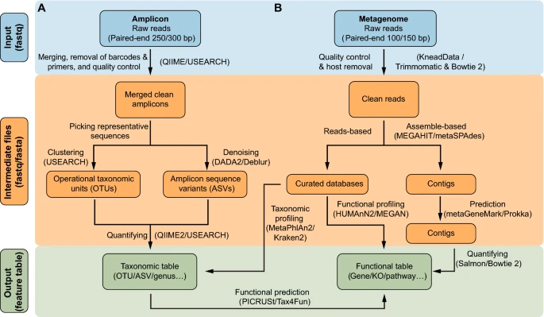
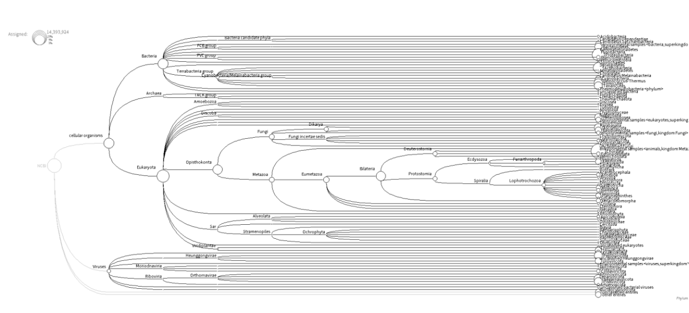
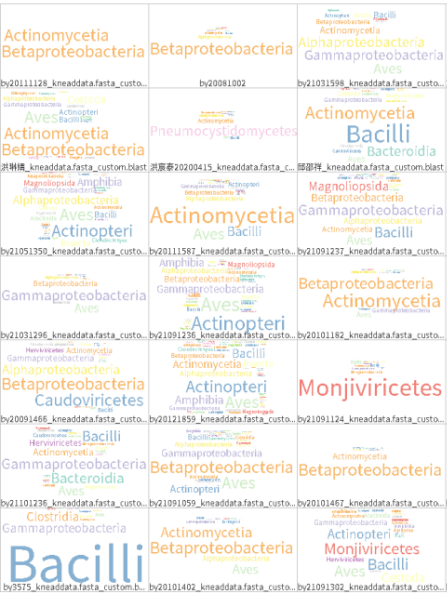

# Metagenomic_shotgun-seq_pipeline
>Author：Chronostasis
<!-- TOC -->

- [Metagenomic_shotgun-seq_pipeline](#metagenomic_shotgun-seq_pipeline)
    - [0_Preparations](#0_preparations)
    - [1_Quality control](#1_quality-control)
    - [2_Filter out host genome and low-qual reads](#2_filter-out-host-genome-and-low-qual-reads)
    - [3_Convert clean fastq output from kneaddata to fasta](#3_convert-clean-fastq-output-from-kneaddata-to-fasta)
    - [4_Blast](#4_blast)
        - [4_0_Preparation](#4_0_preparation)
        - [4_1_Run](#4_1_run)
            - [4_1_1_For a sample](#4_1_1_for-a-sample)
            - [4_1_2_For many samples](#4_1_2_for-many-samples)
    - [5_Blast to rma file](#5_blast-to-rma-file)
    - [6_Megan6](#6_megan6)
    - [7_Kraken2 [Alternative]](#7_kraken2-alternative)
        - [7_0 Preparation](#7_0-preparation)
            - [7_0_1_install](#7_0_1_install)
            - [7_0_2_reference](#7_0_2_reference)
        - [7_1_Run](#7_1_run)
            - [7_1_1For a sample](#7_1_1for-a-sample)
            - [7_1_2 For many samples](#7_1_2-for-many-samples)
        - [7_2_Process_the_profile](#7_2_process_the_profile)
        - [7_3_Alpha_diversity](#7_3_alpha_diversity)
            - [1. use the script of EasyMetagenomic](#1-use-the-script-of-easymetagenomic)
            - [2. phyloseq（R）](#2-phyloseqr)
        - [7_4_Visualization](#7_4_visualization)
            - [7_4_1_Convert to the format of metaphalan2 (spf)](#7_4_1_convert-to-the-format-of-metaphalan2-spf)
            - [7_4_2_Heatmap](#7_4_2_heatmap)
    - [Summary](#summary)

<!-- /TOC -->


本实验室的流程类似于文章[A practical guide to amplicon and metagenomic analysis of microbiome data](https://link.springer.com/article/10.1007/s13238-020-00724-8)中B的workflow，但是使用的是Blast和MEGAN。**后面的可视化结果一般是使用Phylum门和Genus属两类进行展示。**



## 0_Preparations

	# Tools needed
	## fastqc: QC,multiqc
	## Kneaddata: filter host genome and trim
	## Multiqc: multiqc report
	## seqtk: convert fastq file into fasta (for blast)
	## Blast+: Blastn
	## megan6: visulization and statistics

> Set the directory
```bash
Work_directory=/home/User/metagenomic
data_dir=/share/data
```

```bash
# 下载最新版miniconda3，~49M
wget -c https://repo.anaconda.com/miniconda/Miniconda3-latest-Linux-x86_64.sh
# 安装，-b批量，-f无提示，-p目录，许可协议打yes
bash Miniconda3-latest-Linux-x86_64.sh -b -f
cd /home/User/miniconda3
#=====================================================

# ++++++++Create a conda env for metaphlan3 analysis++++++++

#=====================================================
module load conda
# 1. Create a conda envrionment with python 3.7
conda create -n metag python=3.7
### create a environment named 'metag'
conda activate metag
### activate and enter the env

# 2. Install needed packages/tools
mkdir -p /home/User/tools
wget -P /home/User/tools https://www.bioinformatics.babraham.ac.uk/projects/fastqc/fastqc_v0.11.9.zip
cd /home/User/tools
unzip fastqc_v0.11.9.zip
## Multiqc
pip install --user multiqc
## seqtk tools https://github.com/lh3/seqtk
#conda install seqtk
conda install -c bioconda seqtk
## kneaddata3
#conda install kneaddata3
pip install kneaddata
# Blast+
conda install -c bioconda blast
# blast安装perl模块的方法
conda install -c bioconda perl-digest-md5

## download kneaddata databases
mkdir $Work_directory/refdata && mkdir -p $Work_directory/refdata/human_genome && cd  $Work_directory/refdata/human_genome
wget -c http://210.75.224.110/db/kneaddata/human_genome/Homo_sapiens_hg37_and_human_contamination_Bowtie2_v0.1.tar.gz
tar xvzf Homo_sapiens_hg37_and_human_contamination_Bowtie2_v0.1.tar.gz

# MEGAN6
## visualization for PC
https://software-ab.informatik.uni-tuebingen.de/download/megan6/welcome.html
## Linux
# 方法1. conda安装 http://bioconda.github.io/ 6.12.3-0 built 14 Aug 2018，构建一个环境，但不是最新版
conda create -n megan # 创建megan环境
conda activate megan # 进入megan环境
conda install megan # 安装megan，235Mb 版本太低
# 方法2. 直接安装
wget -c https://software-ab.informatik.uni-tuebingen.de/download/megan6/MEGAN_Community_unix_6_18_4.sh
bash MEGAN_Community_unix_6_18_4.sh
# JVM must be at least 11. Please define INSTALL4J_JAVA_HOME to point to a suitable JVM
java -version # 1.8.0_201
# 安装完上面conda会变为 openjdk version "11.0.1-internal" 2018-10-16
```


## 1_Quality control
```bash
mkdir $Work_directory/result/QC
## nohup这个命令代表“不挂断”。挂断 ( HUP )信号通常被发送到进程以通知它用户已注销（或“挂起”），被nohup拦截，允许进程继续运行。
nohup fastqc $data_dir/*.gz -t 15 -o $Work_directory/result/QC & > qc.log &

# Multiqc
mkdir $Work_directory/result/QC/multiqc
multiqc $Work_directory/result/QC/*.zip -o $Work_directory/result/QC/multiqc/
```

## 2_Filter out host genome and low-qual reads
```bash
mkdir $Work_directory/result/kneaddata
# Criteria
source activate /home/User/miniconda3/envs/metag
for i in $data_dir/*.fq.gz; do kneaddata -i $i \
    -o $Work_directory/result/kneaddata -v -t 20 --remove-intermediate-output \
    --trimmomatic /home/User/miniconda3/envs/metag/share/trimmomatic-0.39-2 \
    --trimmomatic-options="MINLEN:25" \œ
    --bowtie2-options="--very-fast" \
    --bypass-trf \
    -db $Work_directory/refdata/human_genome/;
done &> kneaddata.log &

## QC for kneadout file
cd $Work_directory/result/kneaddata
mkdir fastqc
nohup fastqc *.fastq -t 10 -o ./fastqc/ & > qc.log &

mkdir multiqc
multiqc ./fastqc/*data_fastqc.zip -o multiqc

## remove human genome splited out by kneaddata
rm ./*contam.fastq
```

## 3_Convert clean fastq output from kneaddata to fasta
```bash
cd $Work_directory/result/kneaddata
mkdir $Work_directory/result/kneaddata/fasta
# Convert
for i in *_kneaddata.fastq; do seqtk seq -a $i >  $Work_directory/result/kneaddata/fasta/${i%.fastq}.fasta;
done
### check fasta and fastq reads number
expr $(cat *.fastq | wc -l) / 4
grep ">" ../fasta/*_kneaddata.fasta | wc -l
```

##  4_Blast

>**目前由于网络问题和建库问题，未能实践成功。**
<mark>如果运行大批量样本的数据时，应当尝试使用一个样本测试结果，尤其是blast这种需要耗时极其久的module，该moduled的最后结果检查在Megan6的rma2info</mark> 。
**如果无任何物种信息(unclassified)，则可能出现问题，推测无法调用blast的reference库（发现之前设定路径至系统文件后无法使用之前已经建立好的reference库）。**

### 4_0_Preparation

> **构建blast数据库参考文章**
> 1. [构建NR数据库](https://cloud.tencent.com/developer/article/1943973)
> 2. [按物种拆分blast本地库](https://www.burning.net.cn/article/article-59)

```bash
# 1) Download pre-formmated Blast NT database 
## (about 80 GB in gz, decompression will need at least 250 GB storage)
nohup update_blastdb.pl --passive --timeout 1000 --num_threads 15 --decompress nt &> update.log &

echo 'export PATH="$PATH:/share/data0/reference/blastDB/nt"' >> ~/.bashrc
## this will take a long time, check status in case it breaks
### jobs command:https://www.cnblogs.com/machangwei-8/p/10391470.html
jobs -l
## check jobs or
ps -aux | grep update_blastdb
## if breaks, just repeat the nohup line, it will continue from where it stopped

# 2) NCBI blast configuration settings
## Blast needs a configuration file before running to find where databases are stored
## Create a txt formated file named .ncbirc, store in HOME directory. Refer to official manual and an example (https://www.jianshu.com/p/de28be1a3bea)

# 3) Build microorganisms database from nt database
## search txid for archaea, bacteria, viruses (refer to https://www.icode9.com/content-2-1171015.html)
### archaea
txid2157
https://www.ncbi.nlm.nih.gov/Taxonomy/Browser/wwwtax.cgi?mode=Info&id=2157&lvl=3&lin=f&keep=1&srchmode=1&unlock

###bacteria
txid2
https://www.ncbi.nlm.nih.gov/Taxonomy/Browser/wwwtax.cgi?mode=Tree&id=2&lvl=3&srchmode=1&keep=1&unlock

### viruses
txid10239
https://www.ncbi.nlm.nih.gov/Taxonomy/Browser/wwwtax.cgi?mode=Info&id=10239&lvl=3&lin=f&keep=1&srchmode=1&unlock

### fungi
txid4751[ORGN]

### Esearch: install the software. https://www.ncbi.nlm.nih.gov/books/NBK179288/
sh -c "$(wget -q ftp://ftp.ncbi.nlm.nih.gov/entrez/entrezdirect/install-edirect.sh -O -)"
vi ~/.bashrc
export PATH=${PATH}:/home/User/miniconda3/edirect
source ~/.bashrc
### Esearch: download intact NCBI records of accession list file for nt subset construction.
#### 搜索时的==[ORGN]==是必须加上的，因为其代表整个团体，若不加上hi职能搜到其txid所代表的那一个物种。 
mkdir ~/blast/reference
### archaea
esearch -db nuccore -query "txid2157 [ORGN]" | efetch -format acc > archaeatxid2157-accessionlist.txt
### Bacteria accession list too big, download by below command line using esearch can avoid internet cutout and browser breakdown
esearch -db nuccore -query "txid2 [ORGN]" | efetch -format acc > bacteriatxid2-accessionlist.txt
### viruses
esearch -db nuccore -query "txid10239 [ORGN]" | efetch -format acc > virusestxid10239-accessionlist.txt
### fungi
esearch -db nuccore -query "txid4751 [ORGN]" | efetch -format acc > fungitxid4751-accessionlist.txt

# Use the list of GIs from the previous step with the blastdb_aliastool to build an aliased blastdb of just your organism (takes several seconds)
## https://www.ncbi.nlm.nih.gov/books/NBK569848/
### update the parmeters 
blastdb_aliastool -seqidlist ~/reference/archaeatxid2157-accessionlist.txt -db nt -out nt_archaea  -dbtype nucl -title nt_archaea
# Created nucleotide BLAST (alias) database nt_archaea with 370131 sequences

blastdb_aliastool -seqidlist ~/reference/virusestxid10239-accessionlist.txt -db nt -out nt_viruses  -dbtype nucl -title nt_viruses
# Created nucleotide BLAST (alias) database nt_viruses with 1062002 sequences

blastdb_aliastool -seqidlist ~/reference/bacteriatxid2-accessionlist.txt -db nt -out nt_bacteria  -dbtype nucl -title nt_bacteria
# Created nucleotide BLAST (alias) database nt_bacteria with 7649329 sequences

blastdb_aliastool -seqidlist ~/reference/fungitxid4751-accessionlist.txt -db nt -out nt_fungi  -dbtype nucl -title nt_fungi
# Created nucleotide BLAST (alias) database nt_fungi with 6791608 sequences

### Aggregate databases (https://www.ncbi.nlm.nih.gov/books/NBK569848/)
blastdb_aliastool -dblist "nt_bacteria nt_archaea nt_fungi nt_viruses" -dbtype nucl \
  -out nt_bac_arc_fun_vir -title "nt_bac_arc_fun_vir"
# Created nucleotide BLAST (alias) database nt_bac_arc_fun_vir with 15873070 sequences (NEW)
```
>目前blast数据库存储位置!!! change blastdb `/share/data0/reference/blastDB/`

### 4_1_Run
####  4_1_1_For a sample
```bash
# 4. Run blast on nt_bac_arc_fun_vir database
## limit max_target_seqs and -max_hsps to shrink down blast file size (run time will not be shortened significantly)
## *_kneaddata.fasta missed
mkdir $Work_directory/result/blast
module load blast+/v2.13.0
blastn -query $Work_directory/result/kneaddata/fasta/*_kneaddata.fasta -task megablast -outfmt 6 -db nt_bac_arc_fun_vir -max_target_seqs 10 -max_hsps 5 -num_threads 8 -out $Work_directory/result//blast/*_kneaddata.fasta_custom.blast

## gunzip while preserve gz file
gunzip -c *_kneaddata.fasta_custom.blast.gz >*_kneaddata.fasta_custom.blast

```

####  4_1_2_For many samples
```bash
# because of the storage
## run every sample in the same time using 1 thread for each

cd /home/User/metagenomic/result/kneaddata/fasta
# split the samples in order to allocate to different nodes 
## 4 folders: node(1-7)
File=/home/User/metagenomic/List/List_7.txt
cat $File | while read LINE || [[ -n ${LINE} ]]
do
  i=$(echo $LINE |sed 's/\n//g')
  x=${i%.fq.gz*}; 
  echo $x
  ## bash .slurm $1 $2 $3
  bash /home/User/metagenomic/result/blast/blast_job/base.slurm $x 7 /home/User/metagenomic/result/blast/blast_job/node7
done

# base.slurm
infile=$1
node=compute0$2
save_dir=$3
process=$infile
run_job=$save_dir/$infile.job
echo "#! /bin/bash" > $run_job
echo "#SBATCH --job-name=$process" >> $run_job
echo "#SBATCH -w $node" >> $run_job
echo "#SBATCH --time 20000:00:00" >> $run_job
echo "#SBATCH --nodes 1" >> $run_job
echo "#SBATCH --ntasks 1" >> $run_job
echo "#SBATCH --output=$process.log" >> $run_job
echo "module load blast+/v2.13.0" >> $run_job
echo "blastn -query /home/User/metagenomic/result/kneaddata/fasta/$infile\_kneaddata.fasta -task megablast -outfmt 6 -db /share/data0/reference/blastDB/nt/nt_bac_arc_fun_vir -max_target_seqs 10 -max_hsps 5 -num_threads 3 -out /home//User/metagenomic/result/blast/${infile}_kneaddata.fasta_custom.blast" >> $run_job
sbatch $run_job

```


## 5_Blast to rma file
```bash
### 下载参考数据库
wget --no-check-certificate https://software-ab.informatik.uni-tuebingen.de/download/megan6/megan-nucl-Feb2022.db.zip

module load megan/v6_22_2

## convert blast file to rma6[e.g.]
blast2rma -i ~/PE/blast/new/by20081002_kneaddata.fasta_custom.blast -o ~/PE/megan/by20081002.rma6 -c -m 100 -ms 100 -sup 1 -me 0.01 -top 50 -t 15 -tn -f BlastTab -mdb ~/PE/megan/megan-nucl-Feb2022.db

### convert multiple samples[e.g.]
cd  ~/PE/blast/new2/
for i in `ls *kneaddata.fasta_custom.blast`;do
  echo $i
  blast2rma -i $i -o ~/PE/megan/new2/$i.rma6 -c -m 100 -ms 100 -sup 1 -me 0.01 -top 50 -t 15 -tn -f BlastTab -mdb ~/PE/megan/megan-nucl-Feb2022.db
done

## extract rma6 file info

rma2info -i by20081002.rma6 -c2c Taxonomy -r2c Taxonomy -n true --paths true --ranks true --list true --listMore true  -v > by20081002.txt

```

## 6_Megan6
```bash

# 运行命令，需要图型界面支持，如远程桌面，或本地安装配置Xing/Xmanager
# Merge all species and functional data
compute-comparison -i *.rma6 -o ../compared_all_new -v true
compute-comparison -i /home/xuejing/PE/megan/new2/*.rma6 -o /home/xuejing/PE/megan/compared_all_new2 -v true

## rma6 file can be visualize in Megan6 software
## for multiple sample, "File"->"compare" and select multiple rma6 files
cd  ~/PE/megan/new2/
for i in `ls *.rma6`;do
  echo $i
  rma2info -i $i -c2c Taxonomy -r2c Taxonomy -n true --paths true --ranks true --list true --listMore true  -v > ../info2/${i%_k*}_rma6info.txt
done
```

其中Megan6在第五步完成之后，将rma2info导入本地的Megan6进行分析。
结果示例：




>Megan6的参考资料：
>1. [宏基因组注释和可视化神器MEGAN入门_刘永鑫Adam](https://www.cxyzjd.com/article/woodcorpse/104381643)
>2. [megan6物种分类及作图](https://www.bilibili.com/video/BV1ML41147td/?spm_id_from=333.788&vd_source=56dd36b63aa897886966b262ed3f1ad2)

___________________
__________
**由于blast的数据库建立和调用的问题一直无法得到解决，因此没有结果。由于blast的作用是序列比对以进行物种注释，因此根据[A practical guide to amplicon and metagenomic analysis of microbiome data](https://link.springer.com/article/10.1007/s13238-020-00724-8) 文章内容，选择使用同样功能的软件Kraken2对数据进行物种注释，因为运行速度更快，其匹配的精确度会稍有下降。

**其中Kraken2的代码是参照刘永鑫老师在github的教程[EastMetagenome](https://github.com/YongxinLiu/EasyMetagenome) 和[3. Metagenomic screening of shotgun data](https://paleogenomics-course.readthedocs.io/en/latest/3_Metagenomics_v2.html)， [Data Processing and Visualization for Metagenomics](https://carpentries-incubator.github.io/metagenomics/index.html)，但是由于数据库的更新，EasyMetagenome部分处理代码无法使用，且由于数据自身原因，后面的代码为个人更改后的脚本。**
_____________
__________

## 7_Kraken2 [Alternative]

>The function is similar to the blast.

### 7_0 Preparation

物种注释：基于LCA算法的物种注释kraken2  https://ccb.jhu.edu/software/kraken/

#### 7_0_1_install
```bash
# Install the EasyMetagenomic
cd /User/Kraken_result
wegt https://github.com/YongxinLiu/EasyMetagenome.git
# 1. 直接安装并查看版本
conda install kraken2 -c bioconda -y
kraken2 --version # 2.1.1
conda install bracken=2.6.0 -c bioconda

# 2. 新建环境安装并启动软件环境
conda create -n kraken2 -y -c bioconda kraken2
conda activate kraken2
conda install bracken=2.6.0 -c bioconda
# krakentools 0.1 补充脚本
conda install krakentools -c bioconda
# krona绘图
## krona绘图的代码见前面提到的参考文章Data Processing and Visualization for Metagenomics
conda install krona -c bioconda

# csv表格统计工具
conda install csvtk -c bioconda

```

#### 7_0_2_reference

下载数据库(NCBI每2周更新一次)，记录下载日期和大小。需根据服务器内存、使用目的选择合适方案。--standard标准模式下只下载5种数据库：古菌archaea、细菌bacteria、人类human、载体UniVec_Core、病毒viral。也可选直接下载作者构建的索引，还包括bracken的索引。

下载标准+原生动物+真菌+植物8GB(PlusPFP-8)数据库，包括kraken2和bracken2的索引。更多版本数据库详见：https://benlangmead.github.io/aws-indexes/k2 。

```bash
mkdir -p ~/db/kraken2 && cd ~/db/kraken2
# 1. 迷你库(8G，低配推荐)
# 压缩包5.2G，
	cd /User/kraken2/mini
    wget -c https://genome-idx.s3.amazonaws.com/kraken/k2_pluspf_8gb_20210517.tar.gz
    # 备用地址：
    # wget -c http://210.75.224.110/db/kraken2/k2_pluspf_8gb_20210517.tar.gz
    tar xvzf k2_pluspf_8gb_20210517.tar.gz
    
# 2. 完整库(70G，高配推荐)
## 压缩包70G，解压后100G。指定解压目录，包括时间和类型。201202为更新时间，pfp指标准库+原生动物+真菌+植物。注：但我使用中发现仍然没有真菌。
    d=201202pfp
    mkdir ${d}
    wget -c https://genome-idx.s3.amazonaws.com/kraken/k2_pluspfp_20201202.tar.gz
    tar xvzf k2_pluspfp_20201202.tar.gz -C ${d}

# 3. 第3方个性数据库(人和病毒含新冠)，仅用于病毒检测
## https://genexa.ch/sars2-bioinformatics-resources/
    wget -c https://storage.googleapis.com/sars-cov-2/kraken2_h%2Bv_20200319.tar.gz
    mkdir -p 200319hv/
    tar xvzf kraken2_h+v_20200319.tar.gz -C 200319hv/
```


### 7_1_Run
#### 7_1_1For a sample
```bash
kraken2 --db /User/kraken2/mini $i\
      --threads 8 --use-names --report-zero-counts \
      --report /User/kraken_result/report/$i.report \
      --output /User/kraken_result/report/$i.output

kreport2mpa.py -r /User/kraken_result/report/$i \
       --display-header \
       -o /User/kraken_result/report/$i.mpa
```

#### 7_1_2 For many samples
```bash
for i in `ls *.fastq`;do
	kraken2 --db /User/kraken2/mini $i\
	      --threads 8 --use-names --report-zero-counts \
	      --report /User/kraken_result/report/$i.report \
	      --output /User/kraken_result/report/$i.output
done

for i in `ls *.report`;do
    echo $i
    kreport2mpa.py -r /User/kraken_result/report/$i \
       --display-header \
       -o /User/kraken_result/report/$i.mpa
done
```

### 7_2_Process_the_profile
1. In Linux
```bash
# linux
mkdir -p /User/kraken_result/summary
# 输出结果行数相同，但不一定顺序一致，要重新排序
for i in `ls *.mpa`;do
    tail -n+2 $i | LC_ALL=C sort | cut -f 2 | sed "1 s/^/{1}\n/" > /User/kraken_result/report/$i\_count;done
    
# 提取第一样本品行名为表行名
for i in `ls *.mpa`;do
	echo $i
    tail -n+2 $i | LC_ALL=C sort | cut -f 1 | \
      sed "1 s/^/Taxonomy\n/" > /User/kraken_result/summary/0header_count
done
    
head -n3 /User/kraken_result/summary/0header_count

# paste合并样本为表格
ls /User/kraken_result/report/*_\count
paste /User/kraken_result/report/*\_count > /User/kraken_result/summary/tax_count.mpa

# 检查表格及统计
csvtk -t stat /User/kraken_result/summary/tax_count.mpa

## Get the sample_names
ls | grep "_count$" > /User/kraken_result/metadata.txt
## R
module load R
R
```

2. In R
```r
# R
library(data.table)
counts <- fread("/User/Kraken_result/summary/tax_count.mpa",header=T,sep="\t")
col <- fread("/User/Kraken_result/summary/0header_count",header=T,sep="\t")
sampleid <- fread("/User/Kraken_result/metadata.txt",header=T,sep="\t")
rownames(counts)<-col$Taxonomy
colnames(counts)<-sampleid$SampleID
head(counts)
write.table(counts,"/User/Kraken_result/summary/allcounts.mpa",sep="\t")
write.csv(counts,"/User/Kraken_result/summary/allcounts.csv")
write.table(counts,"/User/Kraken_result/summary/allcounts.txt")
```


### 7_3_Alpha_diversity
#### 1. use the script of EasyMetagenomic
```bash
mkdir /User/Kraken_result/alpha
# alpha多样性
# 提取种级别注释并抽平至最小测序量，计算6种alpha多样性指数
# -d指定最小样本量，默认0为最小值，抽平文件tax_norm.txt，alpha多样性tax_alpha.txt
Rscript /User/Kraken_result/EasyMicrobiome/script/kraken2alpha.R \
    --input /User/Kraken_result/summary/allcounts.mpa \
    --depth 0 \
    --species /User/Kraken_result/tax_count.txt \
    --normalize /User/Kraken_result/tax_count.norm \
    --output /User/Kraken_result/alpha/tax_count.alpha

# 绘制Alpha多样性指数，结果为输入文件+类型richness/chao1/ACE/shannon/simpson/invsimpson
# Rscript $sd/alpha_boxplot.R -h # 查看参数
Rscript /User/Kraken_result/EasyMicrobiome/script/alpha_boxplot.R \
    -i /User/Kraken_result/tax_count.alpha \
    -a shannon \
    -d /User/Kraken_result/metadata.txt \
    -n Group \
    -o /User/Kraken_result/alpha/ \
    -w 89 -e 59
# 批量计算6种指数的箱线图+统计
for i in richness chao1 ACE shannon simpson invsimpson;do
	Rscript /User/Kraken_result/EasyMicrobiome/script/alpha_boxplot.R -i /User/Kraken_result/rawdata_kraken/summary/allcounts.mpa -a ${i} \
      -d /User/Kraken_result/rawdata_kraken/metadata_rawdata_info_new.txt -n Group -w 89 -e 59 \
      -o /User/Kraken_result/alpha/
done  
```
____
如果脚本不可以使用，建议更改脚本。
```r
suppressWarnings(suppressMessages(library(amplicon)))
library(multcompView)
# 读取OTU表
alpha_div = read.table("/User/Kraken_result/alpha/tax_count.alpha", header=T, row.names=1, sep="\t", comment.char="",check.names=F)

# 读取实验设计
metadata = read.table("/User/Kraken_result/metadata.txt", header=T, row.names=1, sep="\t", comment.char="", stringsAsFactors = F)

# plot
p = alpha_boxplot(alpha_div, metadata, index = "shannon", groupID = "SampleType")

pdf("/User/Kraken_result/alpha/boxplot_shannon.pdf",width=9,height=8,family="GB1")
print(p)
dev.off()

# function
alpha_boxplot_fun <- function(index_name){
  p = alpha_boxplot(alpha_div, metadata, index = index_name, groupID = "SampleType")pdf(paste0("/User/Kraken_result/alpha/boxplot_",index_name,".pdf"),width=8,height=7,family="GB1")
  print(p)
  dev.off()
}

### 批量画图
 for (i in c("richness","chao1","ACE","shannon","simpson","invsimpson")){
  alpha_boxplot_fun(i)
  print(i)
 }
```

#### 2. phyloseq（R）
使用phyloseq包，见 [Data Processing and Visualization for Metagenomics](https://carpentries-incubator.github.io/metagenomics/index.html)。
可以直接得到相应的每个样本对应的物种注释结果。或者见**chen_16s.rmd** 文件。【P.S. 看起来不难,可以很快上手。 】

### 7_4_Visualization
#### 7_4_1_Convert to the format of metaphalan2 (spf)
```bash
# 转换为metaphalan2 spf格式，分隔符为下划线“__”
   awk 'BEGIN{OFS=FS="\t"}{delete a; a["k"]="unclassified";a["p"]="unclassified";a["c"]="unclassified";a["o"]="unclassified";a["f"]="unclassified";a["g"]="unclassified";a["s"]="unclassified"; \
      split($1,x,"|");for(i in x){split(x[i],b,"__");a[b[1]]=b[2];} \
      print a["k"],a["p"],a["c"],a["o"],a["f"],a["g"],a["s"],$0;}' \
      /User/Kraken_result/tax_count.txt > /User/Kraken_result/temp.txt
    cut -f 1-7,9- /User/Kraken_result/temp.txt > /User/Kraken_result/tax_count.spf
    sed -i '1 s/unclassified\tunclassified\tunclassified\tunclassified\tunclassified\tunclassified\tunclassified/Kingdom\tPhylum\tClass\tOrder\tFamily\tGenus\tSpecies/' \
      /User/Kraken_result/tax_count.spf
```
#### 7_4_2_Heatmap
```bash
### R
if (!suppressWarnings(suppressMessages(require("optparse", character.only = TRUE, quietly = TRUE, warn.conflicts = FALSE)))) {
  install.packages("optparse", repos=site)
  require("optparse",character.only=T) 
}
library(tidyverse)
library(pheatmap)
# 1.读取输入文件
# 读取metaphlan2文件
# 默认的quote会跳过2/3的数据，导致行减少产生NA，改默认值为空
taxonomy = read.table("/User/Kraken_result/tax_count.spf", header=T, sep="\t", quote = "", row.names=NULL, comment.char="",check.names=F)
print(paste0("All taxonomy annotations are ", dim(taxonomy)[1], " lines!"))
# 去除NA，否则无法计算
taxonomy = na.omit(taxonomy)
# 显示样本总数据，有冗余
# colSums(taxonomy)

# 2. 计算过程
taxonomy_index="Phylum"
## 2.1 按指定组合并
grp = taxonomy[, taxonomy_index, drop=F]
abu = taxonomy[,8:dim(taxonomy)[2]]
merge = cbind(abu, grp)
# group_by传变量，前面加".dots="
mergeTax = merge %>% group_by(.dots=taxonomy_index) %>% summarise_all(sum)
# 合并后表格转换为数据框
mergeTax = as.data.frame(mergeTax)
# 按丰度排序
idx = order(rowMeans(mergeTax[,2:dim(mergeTax)[2]]), decreasing = T)
mergeTax = mergeTax[idx,]
# 添加行名
# 处理前期得到的物种名的格式
mergeTax[,1] <- gsub('["]',"",mergeTax[,1])
mergeTax_new <- mergeTax[!duplicated(mergeTax$Phylum),]
rownames(mergeTax_new)=mergeTax_new[,1]

## 2.1 筛选TopN绘图
TopN=10
# remove rownames line
Top = mergeTax_new[,-1]
# normalization to percentage 100
Top = as.data.frame(t(t(Top)/colSums(Top,na=T) * 100)) 
# Select TopN line for plotting
Top = head(Top, n=TopN)

# remove the homo_sapiens
#Top<-Top[-1,]

pdf(paste("/User/Kraken_result/heatmap_",taxonomy_index, ".pdf", sep = ""),width=12,height=8,family="GB1")
pheatmap(Top)
dev.off()
# 3. 结果输出
# 保存表格
write.table(mergeTax_new, file=paste("/User/Kraken_result/",taxonomy_index, ".txt", sep = ""), append = FALSE, sep="\t", quote=F, row.names=F, col.names=T)
```


## Summary
1. 使用的参考文章均附在对应代码块的注释和文字说明中。
2. 物种注释使用blast精确度更高，再导入Meagn6；如果是Kraken2注释结果，可以使用EasyMetagenomic的脚本或者phyloseq包进行可视化alpha多样性。
3. ...
